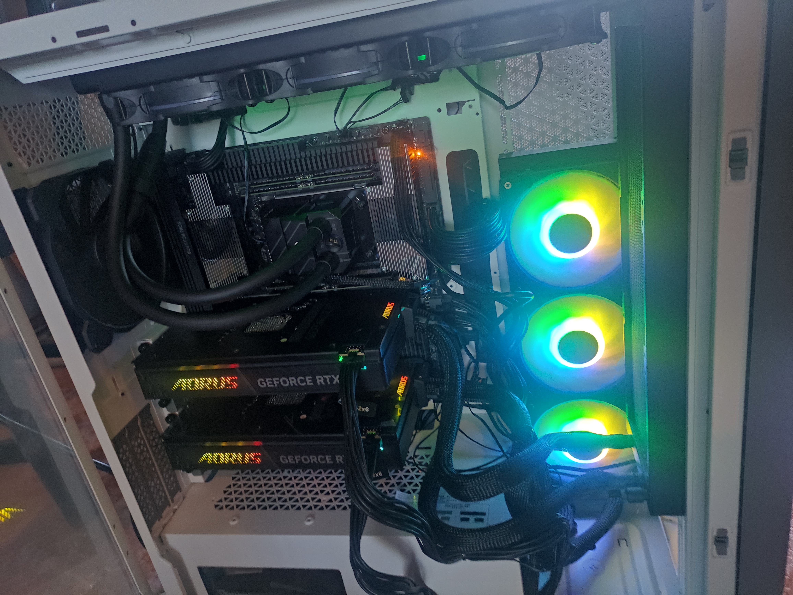
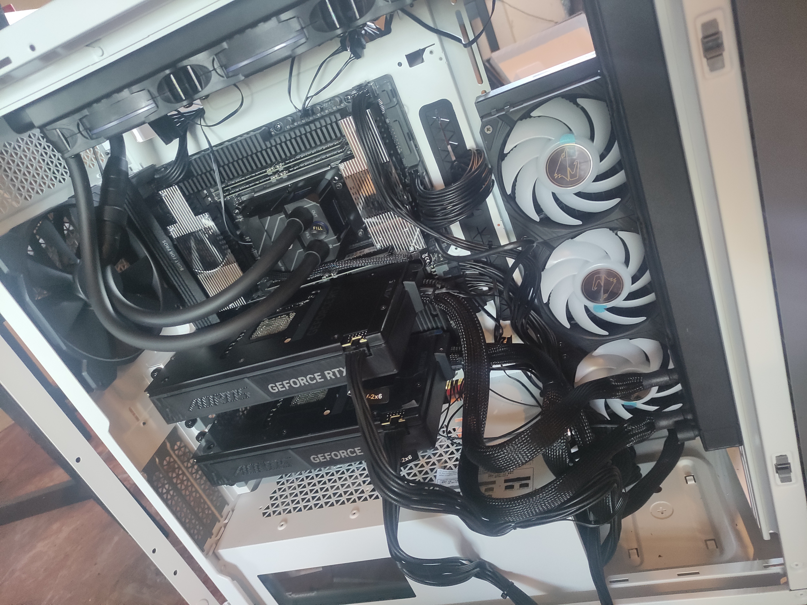

# Bunker HPC Infrastructure Node (ID: TR7960X-5090-DUAL)

## Overview
Technical documentation and hardware specifications for the **Bunker-01 Node**, a dedicated bare-metal environment optimized for high-throughput blockchain validation, and on-premise AI inference.

The objective of this infrastructure is to minimize latency and maximize I/O performance through NUMA-aware resource partitioning and Gen5 storage integration.

## 🛠 Hardware Specifications

| Component | Specification |
| :--- | :--- |
| **CPU** | AMD Ryzen Threadripper 7960X (24 Cores / 48 Threads) |
| **GPU** | 2x NVIDIA RTX 5090 (Blackwell Architecture) - High-bandwidth configuration |
| **RAM** | 128GB DDR5 |
| **Storage (System)** | 2TB NVMe Gen5 |
| **Storage (Chain Data)** | 4TB NVMe Gen5 (XFS Partitioned for Database IOPS) |
| **Network** | Dual 10GbE SFP+ |
| **Thermal** | Custom AIO Liquid Cooling for GPU/CPU + High-airflow chassis |

## 🏗 System Architecture & Optimization

To ensure 24/7 high availability for critical nodes, the following optimizations have been applied:

### 1. Kernel & BIOS Tuning
- **NUMA Nodes Per Socket (NPS):** Configured to **NPS1** for unified memory access in dynamic workloads.
- **CPU Isolation:** Specific cores pinned for blockchain state synchronization to prevent context-switching jitter.
- **IOMMU & Virtualization:** Enabled for secure container orchestration (Docker/KVM).

### 2. Storage Strategy
- **Chain Data Isolation:** Dedicated 4TB Gen5 NVMe mounted with `noatime` and `nodiratime` flags to reduce overhead.
- **Filesystem:** **XFS** for superior handling of large metadata sets and massive parallel I/O, critical for "Gigagas" chains like Rise.

### 3. AI & ZK Compute Layer
- **Inference Engine:** vLLM backend with tensor parallelism across dual 5090s.
- **ZK Proving:** compatibility for hardware-accelerated proof generation.

## 📸 Hardware Gallery

Check the `/gallery` folder for full build documentation.

> *Front view: Optimized airflow path for dual GPU setup.*

> *Internal: Clear view of the TR7960X and the Blackwell dual-GPU array.*

## 📊 Performance Benchmarks (Preliminary)

- **Disk Read/Write:** Sustained >10,000 MB/s (fio benchmark).
- **Network Latency:** Sub-millisecond local routing.
- **GPU Inference:** Optimized for DeepSeek-R1 / Llama-3-70B local deployment.

---
**Operator:** @orianneBunker  
**Status:** 🟢 Operational - Ready for Whitelist Validation  
**Location:** Spain (EU)
